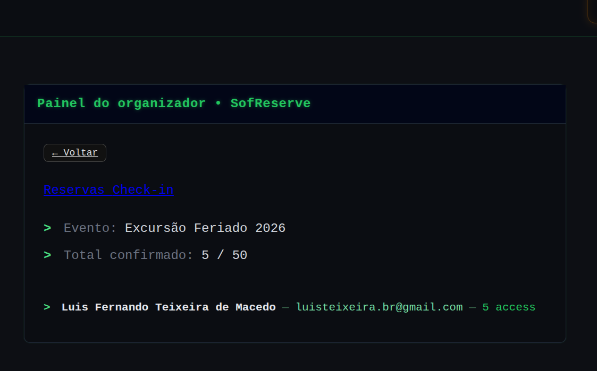
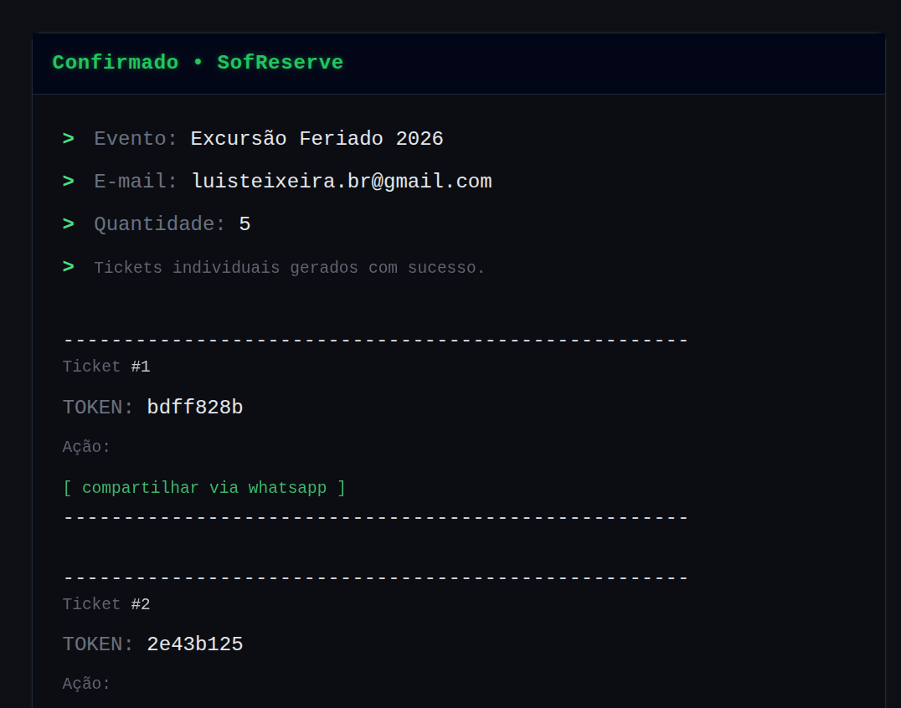
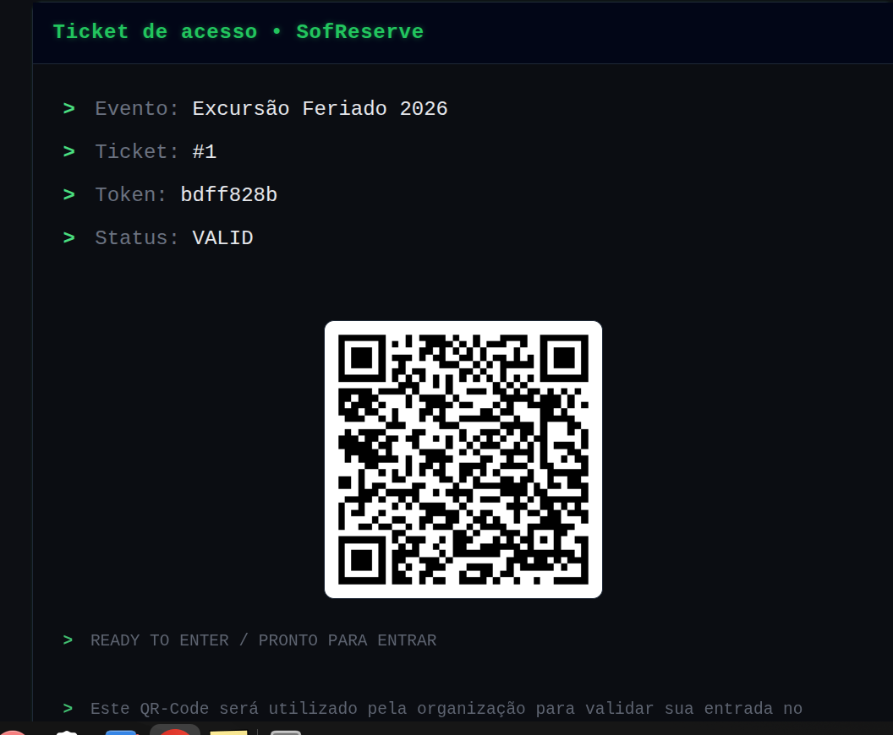
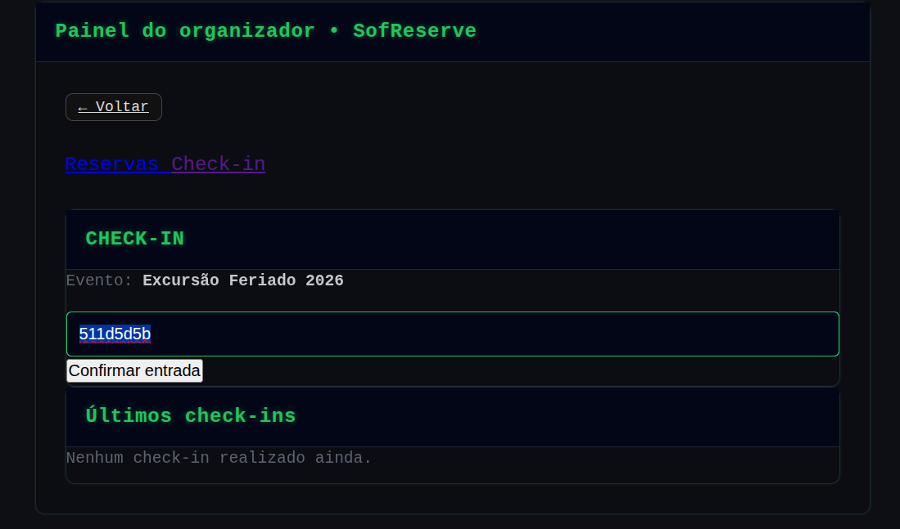

# SOFRESERVE

SOFRESERVE is an event reservation and check-in platform built with Go.

The project was created to explore backend architecture concepts, event management flows, QR-code validation and public ticket access using a lightweight server-side rendered application.

---

## Features

- Event reservation flow
- Public ticket page
- QR-code ticket validation
- Event check-in flow
- Shareable ticket links
- WhatsApp ticket sharing
- Server-side rendering
- Token-based ticket access

---

## Stack

- Go
- PostgreSQL
- HTML Templates
- CSS / Vanilla JavaScript
- Docker Compose

---

## Architecture

Project organized using layered architecture concepts:

- HTTP Handlers
- UseCases
- Repositories
- Shared Services
- HTML Templates

Current structure:

```txt
cmd/
internal/
  adapter/
  core/
  shared/
  view/
migrations/
```

---

## Configuration (Edit the environment variables)

```bash
cp .env.example .env
```

---

## Running locally

### 1. Start database

```bash
docker-compose up -d
```

### 2. Run application

```bash
go run cmd/api/main.go
```

Application will run on:

```txt
http://localhost:8080
```

---

## Current Features Demonstrated

- Reservation confirmation flow
- Public participant ticket page
- Individual ticket tokens
- QR-code generation
- Event check-in validation
- WhatsApp ticket sharing
- Event owner dashboard

---

## Screenshots

### Event Owner Dashboard



### Reservation Confirmation



### Public Access Ticket



### Event Check-in



---

## Goals

The project is being continuously improved with focus on:

- Clean architecture concepts
- Realistic backend flows
- Scalability
- Event management experience
- Go backend development practices

```

```
