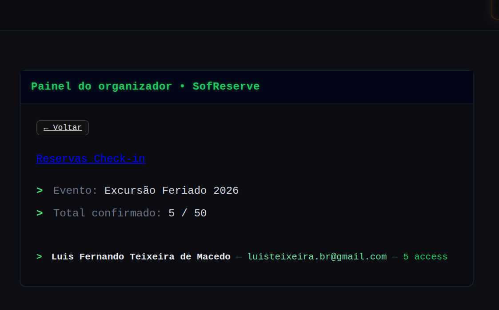
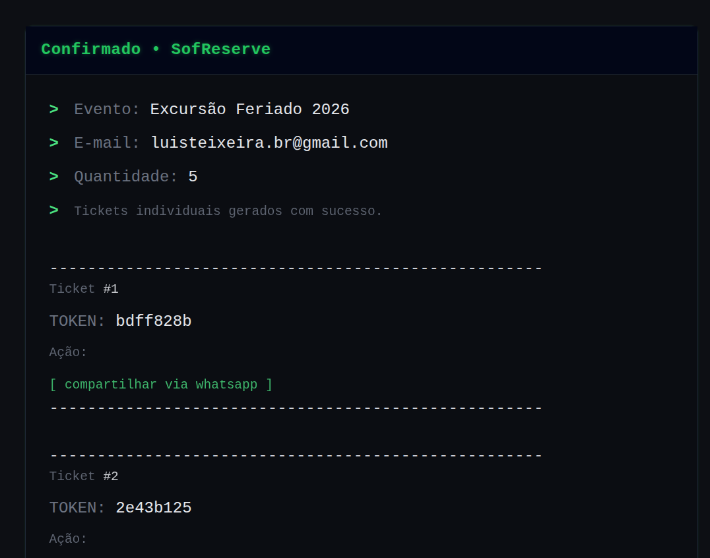
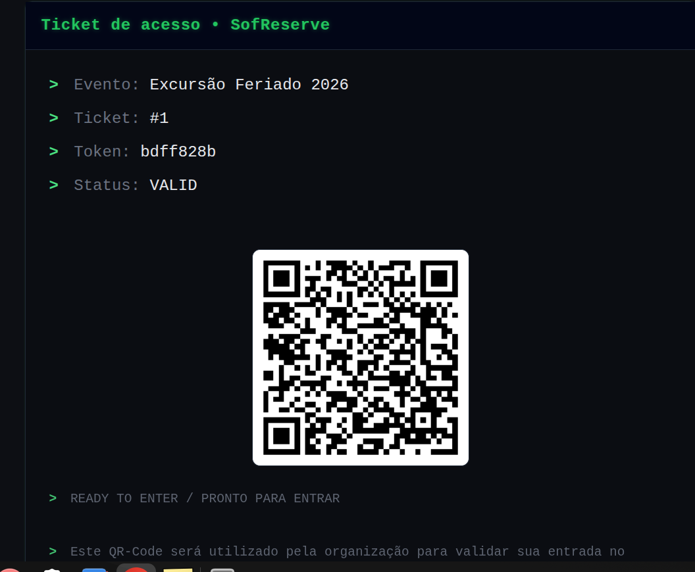
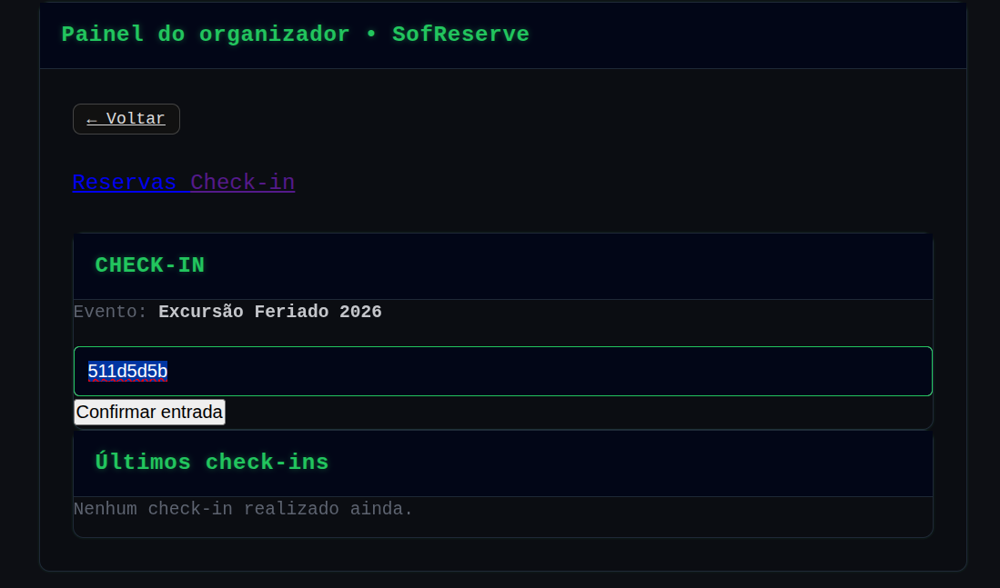

# SOFRESERVE

SOFRESERVE is a backend-focused event reservation and ticketing platform built with Go.

The project models an end-to-end event lifecycle—from event creation and reservation to individual ticket generation, QR-code validation, and concurrent check-in handling.

The project focuses on practical backend engineering: business rules, separation of concerns, PostgreSQL transactions, concurrency protection, automated testing, benchmarking, and CI/CD.

> **📌 Architecture Note**
>
> The system uses public access based on secure tokens to simplify the user journey without requiring account registration or login. The technical complexity is concentrated on business rules, concurrency control, persistence, and clean separation between application layers.

---

## 🎯 Key Technical Highlights

- **Clean Architecture & Domain Separation**
  Clear boundaries between business entities, use cases, ports, HTTP handlers, and persistence adapters.

- **Concurrent Check-in Protection**
  Ticket check-in uses an atomic PostgreSQL update to ensure that a ticket can only be checked in once, even when multiple requests arrive concurrently.

- **Concurrency Testing**
  Includes concurrent check-in tests and a custom CLI benchmarking tool for stress testing HTTP endpoints.

- **Custom Benchmarking Tool**
  CLI utility for generating concurrent requests and measuring throughput and latency, including RPS and percentile metrics such as P50/P99.

- **Token-Based Public Access**
  Reservations and tickets use token-based public access, avoiding unnecessary authentication complexity for the event workflow.

- **Automated Testing & Race Detection**
  GitHub Actions runs the test suite, Go race detector, and application build.

- **CI/CD**
  GitHub Actions provides CI, while Render automatically deploys the `main` branch after successful changes.

- **Production Database**
  Production runs on PostgreSQL managed by Supabase.

---

## 🔄 End-to-End Workflow

```text
Organizer creates an event
        │
        ▼
Participant submits a reservation
        │
        ▼
Reservation is confirmed
        │
        ▼
Individual ticket is generated
        │
        ▼
Participant accesses public ticket
/ticket/{token}
        │
        ▼
Organizer validates ticket via QR code
        │
        ▼
Atomic check-in operation
        │
        ▼
Ticket becomes CHECKED-IN
```

---

## 🏛 Project Architecture

The application follows a pragmatic Clean Architecture approach:

```text
HTTP Handler
     │
     ▼
Use Case
     │
     ▼
Port Interface
     │
     ▼
PostgreSQL Repository
     │
     ▼
PostgreSQL
```

Project structure:

```text
cmd/
├── api/                # API application entrypoint
└── bench/              # Benchmark CLI

internal/
├── adapter/
│   ├── http/           # HTTP handlers and routing
│   └── repository/     # PostgreSQL repositories
│
├── core/
│   ├── entity/         # Domain entities
│   ├── usecase/        # Application use cases
│   └── port/           # Repository interfaces
│
├── infra/
│   └── db/             # Database connection
│
├── shared/             # Cross-cutting utilities
└── view/
    └── templates/      # Server-side HTML templates

migrations/             # Local database migrations
supabase/
└── migrations/         # Production/Supabase migrations
```

---

## 🛠 Tech Stack

### Backend

- Go
- `net/http`
- PostgreSQL
- SQL
- HTML Templates

### Testing

- Go testing
- Concurrent tests
- Go race detector
- HTTP stress testing

### Infrastructure

- Docker
- Docker Compose
- GitHub Actions
- Render
- Supabase PostgreSQL

### Frontend

- Server-side HTML Templates
- CSS
- Vanilla JavaScript

---

## 🚀 Running Locally

### Requirements

- Go
- Docker
- Docker Compose

Clone the repository and enter the project:

```bash
git clone git@github.com:luisteixeira74/sofreserve.git
cd sofreserve
```

Create the local environment file:

```bash
cp .env.example .env
```

Start PostgreSQL:

```bash
docker compose up -d
```

Run the API:

```bash
go run ./cmd/api
```

The application will be available at:

```text
http://localhost:8080
```

Health check:

```bash
curl http://localhost:8080/health
```

Expected response:

```json
{ "status": "ok" }
```

Version information:

```bash
curl http://localhost:8080/version
```

Example local response:

```json
{ "version": "1.0.0", "commit": "unknown" }
```

In production, the commit field identifies the Git commit deployed by Render.

---

## 🧪 Testing

Run the complete test suite:

```bash
go test ./...
```

Run with the Go race detector:

```bash
go test -race ./...
```

---

## 📊 Benchmarking & Stress Testing

SOFRESERVE includes a custom CLI tool for concurrent HTTP stress testing.

Example:

```bash
go run ./cmd/bench \
  -endpoint=http://localhost:8080/events/{event}/checkin \
  -token={ticket_token} \
  -requests=100 \
  -concurrency=10
```

The benchmark tool can be used to evaluate:

- total requests
- successful and failed requests
- throughput (RPS)
- total execution time
- minimum latency
- average latency
- maximum latency
- latency percentiles such as P50/P99

The project also includes concurrent check-in coverage to verify that multiple simultaneous attempts against the same ticket result in a single successful check-in.

---

## 🔒 Concurrent Check-in

The critical check-in operation is protected at the database level.

The ticket is updated only when it has not already been checked in:

```sql
UPDATE reservation_tickets
SET checked_in_at = NOW()
WHERE token = $1
  AND checked_in_at IS NULL;
```

The application checks the number of affected rows to determine whether the check-in succeeded.

This makes the database operation itself responsible for enforcing the single-use rule under concurrent requests.

---

## 🔄 CI/CD

### Continuous Integration

GitHub Actions runs:

```text
Checkout
   ↓
Go setup
   ↓
PostgreSQL container
   ↓
go test ./...
   ↓
go test -race ./...
   ↓
go build ./...
```

The CI database is disposable and separate from the production database.

### Continuous Deployment

The production deployment flow is:

```text
git push main
     ↓
GitHub
     ↓
Render Auto-Deploy
     ↓
Go build
     ↓
Application deployment
     ↓
Supabase PostgreSQL
```

The deployed application exposes:

```text
/health
/version
```

`/health` verifies database connectivity, while `/version` exposes the application version and deployed Git commit.

---

## ☁️ Production

The application is deployed on Render and uses Supabase PostgreSQL as its production database.

**Live application:**

```text
https://sofreserve.onrender.com
```

Production health endpoint:

```text
https://sofreserve.onrender.com/health
```

Production version endpoint:

```text
https://sofreserve.onrender.com/version
```

The `/version` endpoint allows the running application to be correlated with the Git commit deployed to production.

---

## 📸 Screenshots

### Event Owner Dashboard



### Reservation Confirmation



### Public Access Ticket



### Event Check-in



---

## Screenshots

### Event Owner Dashboard


### Reservation Confirmation


### Public Access Ticket


### Event Check-in


---
